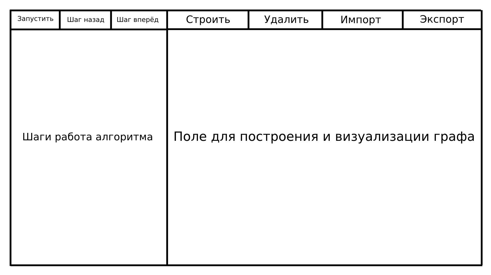

# Кратчайшие пути в графе. Алгоритм Дейкстры.

Репозиторий мини-проекта бригады №6 (летняя практика 2024):

1. Долотов Никита, гр. 2381;
2. Богатов Илья, гр. 2381.
3.  Бочаров Глеб, гр. 2381.

## Спецификация

### Постановка задачи

Разработать приложение на Java с графическим интерфейсом, которое будет визуализировать алгоритм Дейкстры для нахождения кратчайших путей в взвешенном графе, веса всех рёбер неотрицательны. Приложение должно позволять пользователю вводить или загружать из файла граф (в виде вершин и рёбер с весами), выбирать начальную вершину и видеть пошаговую работу алгоритма.

### Описание возможностей программы

Работа с графом:
* Добавление вершин графа в области построения;
* Добавление рёбер между вершинами с указанием их веса;
* Удаление выбранных вершин и рёбер;
* Сохранение и загрузка графов.

Формат файла хранения графа:
* Формат JSON для импорта и экспорта графа;
* Вершины представляются объектами с атрибутами *id*, *x*, *y*;
* Рёбра представляются объектами с атрибутами *startVertex*, *endVertex*, *weight*.

Визуализация:
* Выбор начальной вершины для алгоритма Дейкстры;
* Запуск выполнения алгоритма целиком или по шагам с возможностью перемещения;
* Отображение текущего состояния: текущая обрабатываемая вершина должна быть выделена цветом;
* Релаксация рёбер: ребро, по которому производится релаксация, должно быть выделено цветом;
* Обновление расстояний: минимальные расстояния отображены рядом с каждой вершиной и при их обновлении они выделяются цветом;
* Выводимые текстовые пояснения: номер текущего шага, буквенная метка обрабатываемой вершины, рёбра, по которым производится релаксация, расстояния до вершин, обновлённые после релаксации.

### Псевдокод

```
// V - множество вершин графа
// E - множество рёбер графа
// start - начальная вершина
// dist[] - массив минимальных расстояний от начальной вершины
// used[] - массив обработанных вершин
// w(i) - вес i-го ребра
// e.to - вершина, в которую ведёт ребро e от текущей вершины v

function dijkstra(start):
    for v ∈ V:
        dist[v] = ∞
        used[v] = false
    dist[start] = 0
    for i ∈ V:
        v = null
        for j ∈ V:
            if !used[j] and (v == null or dist[j] < dist[v]):
                v = j
        if dist[v] = ∞:
            break
        used[v] = true
        for e ∈ E (e - edge coming from vertex v):
            if dist[v] + w(e) < dist[e.to]:
                dist[e.to] = dist[v] + w(e)
```

### Интерфейс



1. Панель инструментов:
* "Запустить" - кнопка для запуска работы алгоритма Дейкстры;
* "Шаг назад" - кнопка возврата к предыдущему шагу;
* "Шаг вперёд" - кнопка перехода к следующему шагу;
* "Строить" - кнопка выбора инструмента построения графа (одинарное нажатие - создание вершины; последовательное нажание на две вершины - проведение ребра; двойное нажатие на ребро - открытия окна выбора веса ребра; зажатие ЛКМ на вершине - перетаскивание вершины);
* "Удалить" - кнопка выбора инструмента удаления вершины или ребра (одинарный клик удаляет вершину или ребро);
* "Импорт" - кнопка для загрузки графа из файла;
* "Экспорт" - кнопка для сохранения графа в файл;

2. Область для отображения выполненных шагов алгоритма.
3. Область для построения и визуализации графа.

## План разработки

1. 28.06.24 - Защита вводного задания, демонстрация, согласование спецификации и плана разработки.
2. 01.07.24 - Сдача прототипа программы, демонстрирующего графический интерфейс.
3. 03.07.24 - Сдача программы версии 1 (возможность строить граф, запустить алгоритм и получить результат без пошагового исполнения с выводом текстовых пояснений работы; тестирование версии 1).
4. 05.07.24 - Сдача программы версии 2 (визуализация пошаговой работы алгоритма Дейкстры, внесение правок по итогам защиты альфа-версии; отладка и тестирование).
5. 08.07.24 - Сдача финальной версии программы (реализация тестов; внесение всех правок) и отчёта о проделанной работе.

## Распределение ролей

* Долотов Никита - API графа, реализация алгоритма, интерфейс.
* Богатов Илья - Визуализация алгоритма, тестирование на всех итерациях, оформление отчёта.
* Бочаров Глеб - Сравнение с другими алгоритмами, проведение эксперемента, визуализация результатов

## Уточнения и изменения требований после сдачи прототипа

* Спецификация -> Интерфейс -> Панель инструментов -> "Строить": одинарный клик ПКМ по ребру - открытие окна выбора веса ребра.
